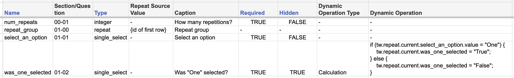

# Migrating surveys

## Taroworks Data

Taroworks stores metadata on its jobs and forms in custom Salesforce objects named like `gfsurveys__{...}__c`. The main ones are:
1. `gfsurveys__Task__c`
    - represents a taroworks job, which is a construct that contains one or more forms and that defines how other Salesforce data may be referenced by those forms
2. `gfsurveys__Survey__c`
    - represents a taroworks form 
    - is connected to (though not a direct child of) `Task`
3. `gfsurveys__Question__c`: 
    - represents individual form questions 
    - is a child of `Survey`
    - contains data like question API name, label, help text, calculation/validation javascript, etc.
4. `gfsurveys__Option__c`
    - represents answer options for multiple-choice questions
    - is a child of `Question`
5. `gfsurveys__SkipCondition`
    - represents show/hide logic for questions
    - is a child of `Question`
6. `gfsurveys__QuestionMapping__c`
    - represents field mappings for questions
    - is a child of `Question`

The queries in `queries.py` pull all relevant data from taroworks jobs and forms. As an example, for the simple survey mentioned in `xml_forms/README.md`, this data might look like this (simplified):

With this data, we can re-define the taroworks survey as a `Survey` containing `Group`s and `Question`s from `xml_forms/utils.py` and use that to save the survey as an XML file.

Most of the question metadata can be directly 'translated' to the commcare format (e.g. type, label, etc.). The main nuances are:
1. Translating non-English answer options
2. Translating formulas
3. Migrating non-hidden calculated questions

### Translating non-English answer options

With non-English TW forms, the answers are submitted to Salesforce in the non-English language. We then set translations for all picklist options in Salesforce itself and Salesforce performs this translation when it receives the non-English answer.

In this script, I check the Salesforce translations for picklist options to set the `art` translation for picklist options to the English question value, which will successfully map to the Salesforce field.

### Translating formulas

Formulas in Taroworks can be almost arbitrary javascript snippets, whereas in Commcare formulas are defined using much more restrictive xpath functions. `surveys/formulas.py` uses `esprima` to parse the javascript into 'nodes' and defines translations for a subset of available nodes. It would be very hard to define universal translations for all nodes but since our taroworks calculations **mostly** follow a few simple formats, we can define translations for a few nodes and that will work for most formulas. 

For the rest, we leave the formulas untranslated but ensure that (1) the uploaded XML file will noisily fail in CC but (2) be easily fixable. We do this by: (1) setting the formula to something that will fail (i.e. `#form/fake_formula`) and adding the untranslated formula to the question comment so it easily accessible.

For questions with calculations that do not follow those common formats, we would like to leave the formulas untranslated but ensure that (1) the uploaded XML file will noisily fail in CC but (2) be easily fixable. I do this by:
1. Add a comment containing the untranslated calculation
2. Add a 'broken' calculation that will noisily crash the form, forcing TPMs to manually translate the calculation before they can deploy the migrated survey

**This is the riskiest part of the migration process.** Some formulas may be incorrectly translated and there is a risk of them silently failing. In most cases, it is likely that we will easily catch this while testing the form.

Some formulas I know will be translated incorrectly are:
- Formulas that contain strings with escaped quotation marks, like: `"here is a string with a \" hidden within it"`
  - This should be very rare - I expect we won't find this
  - The translated formula will noisily fail once the XML is uploaded to CC (and be easy to fix there)
- Formulas that reference themselves
  - The translated formula will noisily fail once the XML is uploaded to CC (and be easy to fix there)

### Translating non-hidden calculated questions

Taroworks allows users to add calculations to questions that are not hidden, which Commcare does not. The way I get around this is by adding two CC questions for every non-hidden calculated TW question:
1. A hidden calculated question that performs the calculation
2. A 'label' question that displays the result