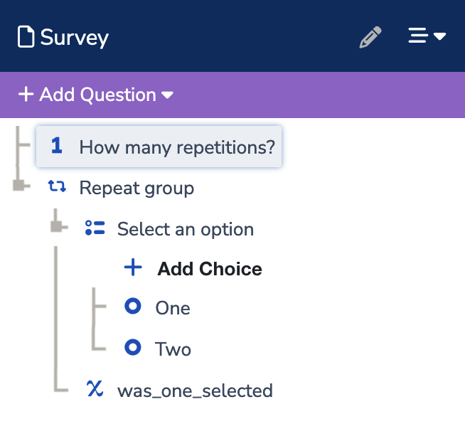

## Overview

The code in this folder allows us to define a survey in code as a `Survey` dataclass and generate an XML file with that surveys xform. This is helpful because it allows us to abstract out all the xform nuances when we want to build new surveys, combine sections or define entire surveys from scratch in code (as a source-of-truth).

We can also build a `Survey` dataclass from an xform with

```python3
import xml.etree.ElementTree as ET
from commcare.xforms import build_survey_from_xform

xform = ET.parse('xform.xml')
survey = build_survey_from_xform(xform)
```

To define surveys from scratch in code, we can use the dataclasses for `Question`s, `Group`s, `Option`s, `ShowLogic`, `Calculation`s and `Validation`s:

```python
from commcare.xforms.classes import *

# Integer question
integer_question = Question(
	name = 'num_repeats',
	type = QuestionType.integer,
	label = {
		Language.english: 'How many repetitions?',
		Language.artificial: '...'
	}
)

# Multiple choice question
option_1 = Option(
	name = 'one',
	label = {
		Language.english: 'One',
		Language.artificial: '1'
	}
)
option_2 = Option(
	name = 'two',
	label = {
		Language.english: 'Two',
		Language.artificial: '2'
	}
)
multiple_choice_question = Question(
	name = 'multiple_choice',
	type = QuestionType.single_select,
	label = {
		Language.english: 'Select an option',
		Language.artificial: '...'
	},
	options = [option_1, option_2]
)

# Calculated question
calculated_question = Question(
	name = 'was_one_selected',
	type = QuestionType.calculation,
	calculation = Calculation(
		calculation = "if({} = {}, 'True', 'False')",
		references = [
			multiple_choice_question,
			option_1
		]
	)
)

# Repeat group
repeat_group = Group(
	name = 'repeat_group',
	label = {
		Language.english: 'Repeat group',
		Language.artificial: '...'
	},
	repeat = integer_question,
	contents = [multiple_choice_question, calculated_question]
)

# Survey
survey = Survey(
	title = 'Survey',
	xmlns = 'http://openrosa.org/formdesigner/{a_form_designer_id}',
	contents = [
		integer_question,
		repeat_group,
	],
	languages = [Language.english, Language.artificial]
)

print(survey.as_xml())
```

## Xforms

You can see a longer specification of the structure of xforms [here](https://dimagi.github.io/xform-spec/). Below is a shorter summary.

Consider this simple Commcare survey:



1. A first question allows the user to enter an integer
2. A repeat section repeats the number of times the user entered above, containing:
   1. A second question allows the user to select one of two options ("One" or "Two")
   2. A calculated question checks if the user answered "One"

The xform for this survey looks like this:

```xml
<?xml version="1.0" encoding="UTF-8" ?>
<h:html xmlns:h="http://www.w3.org/1999/xhtml" xmlns:orx="http://openrosa.org/jr/xforms" xmlns="http://www.w3.org/2002/xforms" xmlns:xsd="http://www.w3.org/2001/XMLSchema" xmlns:jr="http://openrosa.org/javarosa" xmlns:vellum="http://commcarehq.org/xforms/vellum">
	<h:head>
		<h:title>Survey</h:title>
		<model>
			<instance>
				<data xmlns:jrm="http://dev.commcarehq.org/jr/xforms" xmlns="http://openrosa.org/formdesigner/E21F5E89-38B4-4AF1-9E2A-B72C93023720" uiVersion="1" version="1" name="Survey">
					<num_repeat />
					<repeat_group jr:template="">
						<select_an_option />
						<was_one_selected />
					</repeat_group>
				</data>
			</instance>
			<bind vellum:nodeset="#form/num_repeat" nodeset="/data/num_repeat" type="xsd:int" required="true()" />
			<bind vellum:nodeset="#form/repeat_group" nodeset="/data/repeat_group" />
			<bind vellum:nodeset="#form/repeat_group/select_an_option" nodeset="/data/repeat_group/select_an_option" required="true()" />
			<bind vellum:nodeset="#form/repeat_group/was_one_selected" nodeset="/data/repeat_group/was_one_selected" vellum:calculate="#form/repeat_group/select_an_option = 'one'" calculate="/data/repeat_group/select_an_option = 'one'" />
			<itext>
				<translation lang="en" default="">
					<text id="num_repeat-label">
						<value>How many repetitions?</value>
					</text>
					<text id="repeat_group-label">
						<value>Repeat group</value>
					</text>
					<text id="repeat_group/select_an_option-label">
						<value>Select an option</value>
					</text>
					<text id="repeat_group/select_an_option-one-label">
						<value>One</value>
					</text>
					<text id="repeat_group/select_an_option-two-label">
						<value>Two</value>
					</text>
				</translation>
			</itext>
		</model>
	</h:head>
	<h:body>
		<input vellum:ref="#form/num_repeat" ref="/data/num_repeat">
			<label ref="jr:itext('num_repeat-label')" />
		</input>
		<group>
			<label ref="jr:itext('repeat_group-label')" />
			<repeat vellum:jr__count="#form/num_repeat" jr:count="/data/num_repeat" jr:noAddRemove="true()" vellum:nodeset="#form/repeat_group" nodeset="/data/repeat_group">
				<select1 vellum:ref="#form/repeat_group/select_an_option" ref="/data/repeat_group/select_an_option">
					<label ref="jr:itext('repeat_group/select_an_option-label')" />
					<item>
						<label ref="jr:itext('repeat_group/select_an_option-one-label')" />
						<value>one</value>
					</item>
					<item>
						<label ref="jr:itext('repeat_group/select_an_option-two-label')" />
						<value>two</value>
					</item>
				</select1>
			</repeat>
		</group>
	</h:body>
</h:html>
```

Broken down, there are four main sections:
1. Head > Model > Instance
   - lists the groups and questions in order
2. Head > Model > Bind
   - Each group or question has one `bind` tag that contains metadata such as requiredness, calculations, validations, show logic, etc.
3. Head > Model > iText
   - Multiple `text` tags, each containing the full text of some aspect of the survey
   - These can be: group/question/option labels, question help/hint text or question validtaion messages
4. Body
   - Each question gets a new tag in the `body` section containing references to the `itext` tags mentioned above and some more metadata

The classes in this module (`Question`, `Group`, `Option`, etc.) are built with methods that separately define the instance, bind, itext and body xml elements that define the questions and groups.